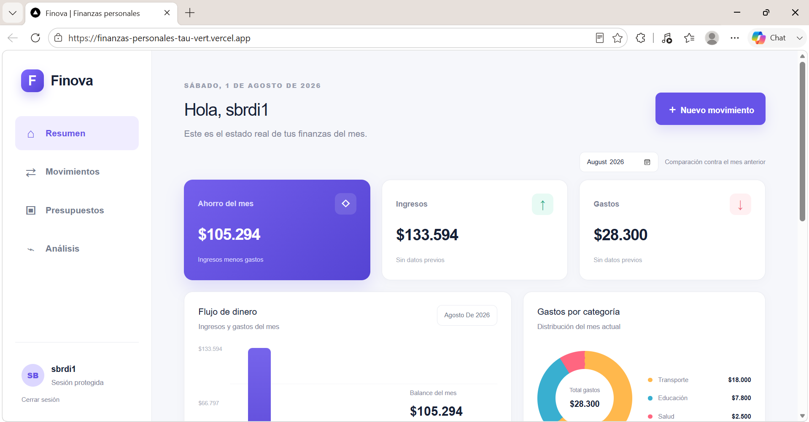
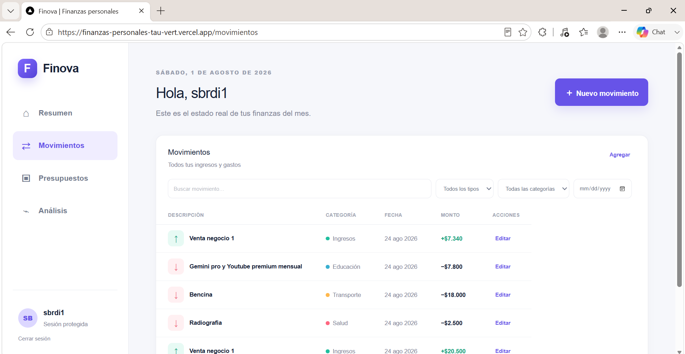
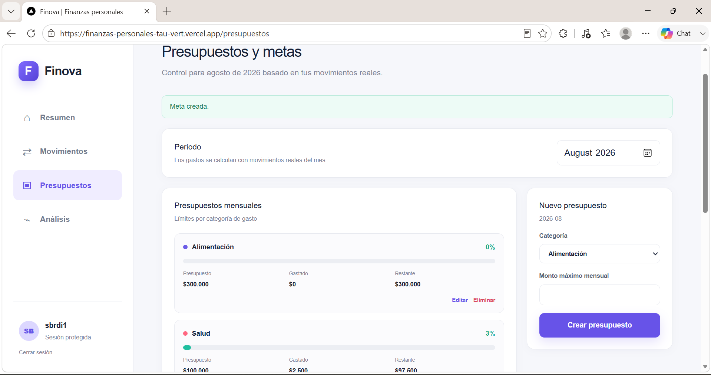
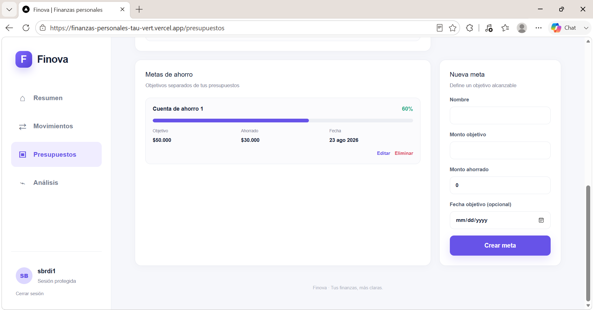
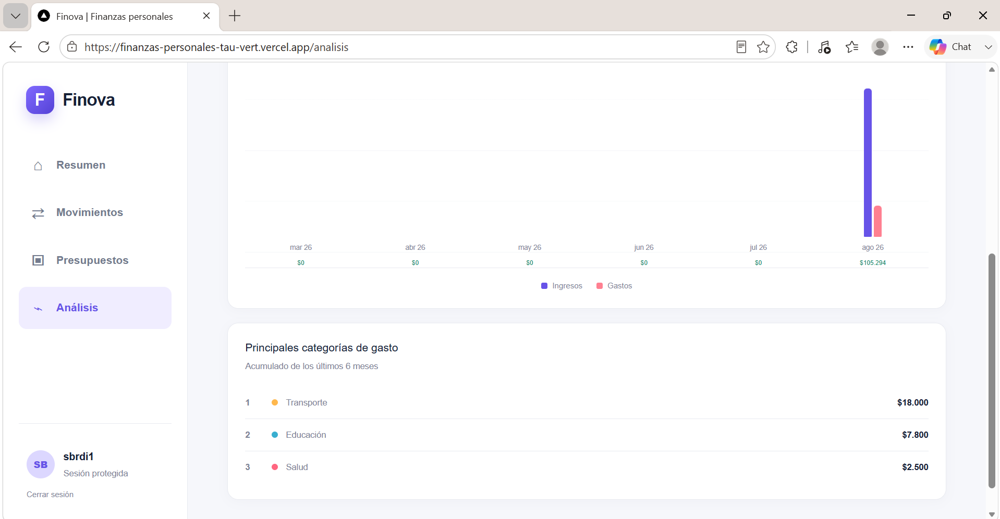

# Finova

Finova es una aplicación full stack de finanzas personales que permite registrar movimientos, organizar presupuestos mensuales, seguir metas de ahorro y analizar la evolución financiera de cada usuario. El proyecto fue construido con foco en seguridad, persistencia multiusuario, experiencia responsive y buenas prácticas de desarrollo.

[Ver demo en producción](https://finanzas-personales-tau-vert.vercel.app)

> La demo utiliza GitHub OAuth. Cada cuenta accede exclusivamente a sus propios datos.

## Capturas del dashboard

### Vista principal y resumen financiero



### Gestión de movimientos



### Presupuestos mensuales



### Metas de ahorro



### Análisis financiero



## Funcionalidades

- Inicio y cierre de sesión mediante GitHub OAuth.
- Sesiones protegidas y persistidas en PostgreSQL.
- Creación, lectura, edición y eliminación de ingresos y gastos.
- Búsqueda y filtros combinables por texto, tipo, categoría y fecha.
- Presupuestos mensuales por categoría con seguimiento de gasto y alertas visuales.
- Metas de ahorro con monto objetivo, progreso y fecha opcional.
- Dashboard con balance, ingresos, gastos, tasa de ahorro y distribución por categorías.
- Análisis histórico de seis o doce meses.
- Comparación entre el mes actual y el mes anterior.
- Separación estricta de datos por usuario.
- Interfaz responsive y formato localizado para pesos chilenos y fechas en español de Chile.

## Tecnologías

| Área | Tecnologías |
| --- | --- |
| Frontend | Next.js, React, TypeScript, React Hook Form |
| Backend | Next.js App Router, Server Components, Server Actions, Zod |
| Datos | PostgreSQL, Neon, Prisma |
| Autenticación | Auth.js, GitHub OAuth, PrismaAdapter |
| Calidad y entrega | GitHub Actions, ESLint, Node.js Test Runner, Vercel |

## Arquitectura general

Finova utiliza una arquitectura full stack sobre Next.js App Router:

```text
Navegador
  ├─ Componentes cliente: formularios, filtros y estados interactivos
  └─ Solicitudes y Server Actions
            │
            ▼
Next.js
  ├─ Server Components: sesión, consultas y composición de vistas
  ├─ Auth.js: GitHub OAuth y sesiones persistidas
  ├─ Zod: validación de entradas en el servidor
  └─ Capa de datos: consultas autorizadas por propietario
            │
            ▼
Prisma ORM ── PostgreSQL en Neon
```

- `src/app/`: rutas, páginas protegidas y Server Actions.
- `src/components/`: componentes de dashboard, movimientos, presupuestos y análisis.
- `src/data/`: acceso a datos `server-only` y autorización por propietario.
- `src/lib/`: esquemas Zod, cálculos financieros, formatos y utilidades probadas.
- `prisma/`: esquema relacional y migraciones SQL.
- `.github/workflows/`: validación continua con GitHub Actions.

La lectura inicial ocurre en el servidor. La interactividad se limita a componentes cliente específicos, manteniendo autenticación, autorización y acceso a PostgreSQL fuera del navegador.

## Modelo de datos

| Entidad | Responsabilidad |
| --- | --- |
| `User` | Propietario de todos los datos financieros y relaciones de autenticación. |
| `Account` | Cuenta OAuth administrada por Auth.js. |
| `Session` | Sesión persistida asociada a un usuario. |
| `VerificationToken` | Token compatible con los flujos de Auth.js. |
| `FinancialAccount` | Cuenta financiera a la que pertenecen los movimientos. |
| `Category` | Clasificación de ingresos o gastos por usuario. |
| `Transaction` | Ingreso o gasto con monto, categoría, cuenta y fecha. |
| `Budget` | Límite mensual por categoría de gasto. |
| `SavingGoal` | Meta con monto objetivo, avance y fecha opcional. |

Los montos utilizan `Decimal(14,2)` y las fechas financieras usan el tipo `DATE` de PostgreSQL. Las claves foráneas, índices y restricciones únicas mantienen la integridad del dominio.

## Seguridad

- **Autorización por propietario:** cada consulta obtiene el usuario desde la sesión; el navegador no decide el `userId`.
- **Protección contra IDOR:** las actualizaciones y eliminaciones filtran simultáneamente por identificador y propietario.
- **Validación en servidor y cliente:** React Hook Form ofrece respuesta inmediata en la interfaz y Zod vuelve a validar cada mutación en el servidor.
- **Sesiones protegidas:** Auth.js persiste las sesiones mediante `PrismaAdapter` y restringe las rutas de la aplicación.
- **Secretos fuera del repositorio:** las credenciales y conexiones se reciben mediante variables de entorno; `.env.local` está ignorado por Git.
- **Acceso a datos solo en servidor:** Prisma y la capa de datos no se exponen al bundle del navegador.

## Instalación local

### Requisitos

- Node.js 20.9 o superior; se recomienda Node.js 22 LTS.
- npm.
- Una base de datos PostgreSQL en Neon.
- Una GitHub OAuth App para desarrollo local.

### Configuración

```bash
git clone https://github.com/sbrdi1/finanzas-personales.git
cd finanzas-personales
npm ci
```

Crea el archivo de entorno local a partir del ejemplo:

```bash
cp .env.example .env.local
```

En PowerShell:

```powershell
Copy-Item .env.example .env.local
```

Configura el callback de la GitHub OAuth App para desarrollo:

```text
http://localhost:3000/api/auth/callback/github
```

Aplica las migraciones y levanta la aplicación:

```bash
npm run db:migrate
npm run dev
```

Abre [http://localhost:3000](http://localhost:3000).

## Variables de entorno

Finova requiere únicamente estos nombres en `.env.local` y en el entorno de producción:

```text
DATABASE_URL
DIRECT_URL
AUTH_SECRET
AUTH_GITHUB_ID
AUTH_GITHUB_SECRET
```

`DATABASE_URL` corresponde a la conexión pooled utilizada por la aplicación y `DIRECT_URL` a la conexión directa utilizada por las migraciones. Este repositorio no contiene valores reales.

## Prisma y migraciones

Crear o aplicar migraciones durante el desarrollo:

```bash
npm run db:migrate
```

Aplicar migraciones existentes en CI o producción:

```bash
npm run db:deploy
```

Regenerar Prisma Client o inspeccionar la base de datos:

```bash
npm run db:generate
npm run db:studio
```

## Calidad y pruebas

Ejecutar cada comprobación por separado:

```bash
npm run test
npm run lint
npm run typecheck
npm run build
```

Ejecutar la validación completa utilizada por GitHub Actions:

```bash
npm run check
```

`npm run check` ejecuta lint, comprobación de tipos, tests y build de producción. Cada push o pull request hacia `main` ejecuta este flujo en GitHub Actions.

## Decisiones técnicas

- **App Router y Server Components:** permiten resolver sesión y datos antes de renderizar las vistas protegidas.
- **Server Actions:** mantienen las mutaciones cerca del dominio, reducen endpoints manuales y permiten revalidar las rutas afectadas.
- **PostgreSQL y Prisma:** entregan relaciones explícitas, migraciones reproducibles y precisión decimal para montos financieros.
- **Neon:** aporta PostgreSQL administrado y conexiones pooled adecuadas para despliegues serverless.
- **Sesiones en base de datos:** facilitan invalidación y control de sesiones en una aplicación multiusuario.
- **Zod como frontera de confianza:** ninguna entrada se utiliza en una mutación antes de validarse en el servidor.
- **Cálculos como funciones puras:** métricas de balance, presupuestos y ahorro quedan separadas de la interfaz y pueden probarse sin renderizar componentes.
- **Gráficos sin dependencia externa:** las visualizaciones actuales se construyen con React y CSS para mantener pequeño el conjunto de dependencias.
- **Vercel y GitHub Actions:** separan la validación continua del despliegue y mantienen un flujo de entrega reproducible.

## Qué aprendí

- Diseñar un dominio financiero relacional con montos decimales y restricciones de integridad.
- Integrar GitHub OAuth con sesiones persistidas mediante Auth.js y PrismaAdapter.
- Aplicar autorización por propietario en todas las operaciones para evitar acceso horizontal entre usuarios.
- Combinar validación cliente/servidor sin confiar en datos enviados desde el navegador.
- Organizar Server Components, componentes cliente, Server Actions y una capa de datos `server-only`.
- Construir análisis mensuales y métricas financieras a partir de datos persistidos.
- Automatizar lint, tipos, tests y build con GitHub Actions y desplegar el resultado en Vercel.

## Estado del proyecto

La versión actual está desplegada y la Fase 3 fue validada manualmente. Incluye autenticación, persistencia multiusuario, CRUD de movimientos, presupuestos mensuales, metas de ahorro, análisis histórico, comparación mensual, filtros y búsqueda.

Finova es un proyecto de portafolio y una demostración educativa; no reemplaza software contable ni asesoría financiera.

## Próximos pasos

- Incorporar pruebas end-to-end de autenticación y recorridos críticos.
- Añadir exportación de movimientos en CSV.
- Permitir administrar múltiples cuentas financieras desde la interfaz.
- Mejorar accesibilidad y navegación mediante teclado.
- Incorporar observabilidad, alertas y una estrategia documentada de respaldo y recuperación.
- Ampliar el análisis con proyecciones y tendencias por categoría.

## Documentación

- [Arquitectura](docs/ARCHITECTURE.md)
- [Base de datos y autenticación](docs/DATABASE_AND_AUTH.md)
- [Despliegue en Vercel](docs/DEPLOYMENT.md)
- [Guía de contribución](CONTRIBUTING.md)
- [Política de seguridad](SECURITY.md)

## Licencia

El repositorio no incluye actualmente un archivo de licencia. Todos los derechos permanecen reservados a su autor hasta que se publique una licencia explícita.
